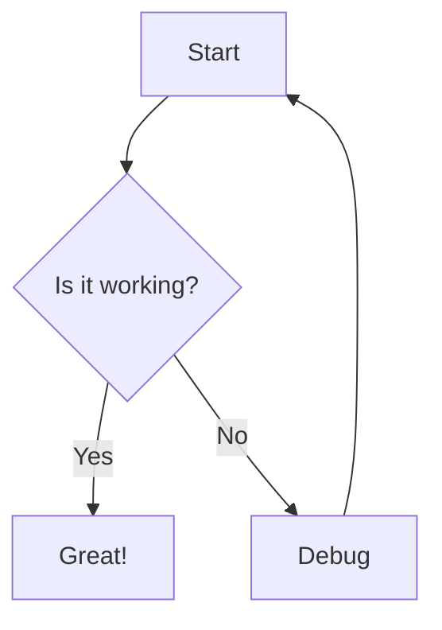

# Comprehensive Markdown Test Suite

## 1. Headers Test

# H1 Header
## H2 Header
### H3 Header
#### H4 Header
##### H5 Header
###### H6 Header

## 2. Text Formatting

This is **bold text** and this is __also bold__.

This is *italic text* and this is _also italic_.

This is ***bold and italic*** text.

This is ~~strikethrough~~ text.

This is `inline code` with backticks.

## 3. Paragraphs and Line Breaks

This is the first paragraph with normal text. Lorem ipsum dolor sit amet, consectetur adipiscing elit.

This is the second paragraph separated by a blank line. It should have proper spacing.

This line has a soft break  
created with two spaces at the end.

## 4. Links

[This is a regular link](https://github.com)

[Link with title](https://github.com "GitHub Homepage")

https://www.example.com - Auto link

Reference style link: [GitHub][1]

[1]: https://github.com "GitHub"

[[Wiki Link]] and [[Wiki Link|with alias]]

## 5. Images


## 6. Lists

### Unordered List
* First item
* Second item
  * Nested item 1
  * Nested item 2
    * Double nested
* Third item

### Alternative Unordered List
- Item with dash
+ Item with plus

### Ordered List
1. First ordered item
2. Second ordered item
   1. Nested ordered item
   2. Another nested item
3. Third ordered item

### Mixed Lists
1. First level ordered
   * Second level unordered
   * Another unordered
2. Back to first level
   - Second level with dash
     1. Third level ordered

## 7. Blockquotes

> This is a blockquote
> with multiple lines

> Nested blockquote
>> This is nested
>>> Triple nested

> Blockquote with **bold** and *italic* text

## 8. Code Blocks

### Generic Code Block
```
function hello() {
    console.log("Hello World");
}
```

### Swift Code Block
```swift
struct ContentView: View {
    var body: some View {
        Text("Hello, World!")
            .padding()
    }
}
```

### JavaScript Code Block
```javascript
const greeting = (name) => {
    return `Hello, ${name}!`;
};
console.log(greeting("World"));
```

### Python Code Block
```python
def fibonacci(n):
    if n <= 1:
        return n
    return fibonacci(n-1) + fibonacci(n-2)

print(fibonacci(10))
```

### Indented Code Block

    This is an indented code block
    with multiple lines
    preserving spacing

## 9. Tables

| Header 1 | Header 2 | Header 3 |
|----------|----------|----------|
| Cell 1   | Cell 2   | Cell 3   |
| Cell 4   | Cell 5   | Cell 6   |

### Aligned Table

| Left Aligned | Center Aligned | Right Aligned |
|:-------------|:-------------:|-------------:|
| Left         | Center        | Right        |
| 123          | 456           | 789          |

### Complex Table

| Feature | Supported | Notes |
|---------|:---------:|-------|
| **Bold** | ✅ | Works in tables |
| *Italic* | ✅ | Also works |
| `Code` | ✅ | Inline code |
| [Links](https://example.com) | ✅ | Clickable |

## 10. Horizontal Rules

---

***

___

## 11. Task Lists

- [x] Completed task
- [ ] Incomplete task
- [x] Another completed task
  - [ ] Nested incomplete
  - [x] Nested complete

## 12. HTML Elements

<div style="color: blue;">
This is HTML content (if supported)
</div>

<details>
<summary>Click to expand</summary>
Hidden content here
</details>

## 13. Escaping

\*Not italic\*
\**Not bold\**
\[Not a link\](not a url)
\`Not code\`

## 14. Special Characters

Copyright © 2024
Trademark ™
Registered ®
Em dash — here
En dash – here
Ellipsis… here

Emoji: 😀 🚀 💻 ✨

## 15. Math (if supported)

Inline math: $E = mc^2$

Block math:
$$
\frac{1}{2} \sum_{i=1}^{n} x_i^2
$$

## 16. Mermaid Diagram



## 17. Footnotes

This text has a footnote[^1].

[^1]: This is the footnote content.

## 18. Definition Lists

Term 1
:   Definition for term 1

Term 2
:   Definition for term 2
:   Another definition for term 2

## 19. Abbreviations

HTML stands for HyperText Markup Language.
*[HTML]: HyperText Markup Language

## 20. Combined Formatting

This paragraph combines **bold text**, *italic text*, `inline code`, [a link](https://example.com), and even ~~strikethrough~~. It should all work together seamlessly.

> A blockquote with **bold**, *italic*, and a [link](https://example.com)
> ```swift
> let code = "in a blockquote"
> ```

### Nested List with Formatting
1. **Bold item**
   - *Italic sub-item*
   - `Code sub-item`
2. Normal item with [a link](https://example.com)
   1. Numbered sub-item with ~~strikethrough~~

---

End of comprehensive test suite.